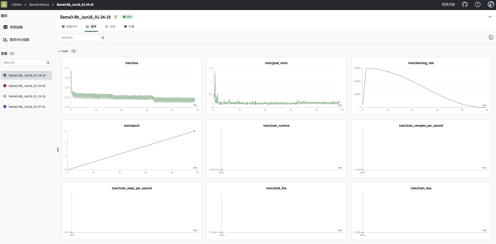
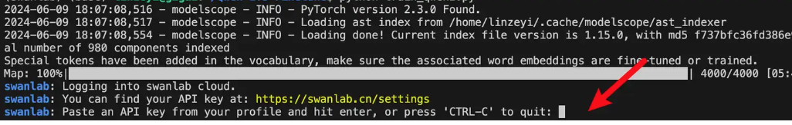
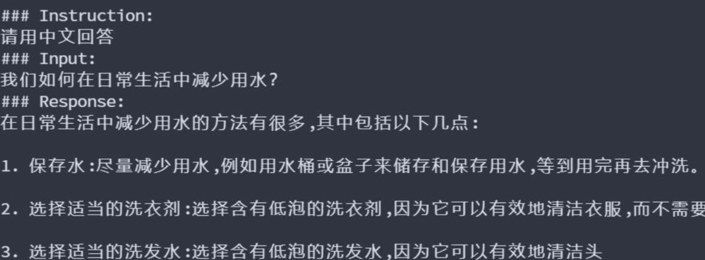

# llama3-fine-tuning-aplace-zh
> llama3微调训练+测试结果

***

本次实验使用swanlab作为训练过程跟踪的可视化工具，既可以在微信公众号Swanlab上查看，也可以在手机APP上随时跟踪，具体使用操作可以参考[手机上查看Swanlab实验的两种方法](https://zhuanlan.zhihu.com/p/704095316)

## 什么是SwanLab?

[](https://swanlab.cn/)

SwanLab是一个深度学习实验管理与训练可视化工具，由西安电子科技大学创业团队打造，融合了Weights & Biases与Tensorboard的特点，可以记录整个实验的超参数、指标、训练环境、Python版本等，并可视化图表，帮助你分析训练的表现。

在训练过程中，你可能因为各种原因无法看到当前实验的最新情况，这个时候如果能够在手机、平板上看到实验的最新进展，及时发现训练的问题，能够节省很多的时间。



SwanLab也与绝大多数主流的训练框架进行了集成，包括PyTorch、HuggingFace Transformers、PyTorch Lightning、MMDetection、Ultralytics、fastai等等，可以开箱即用地与你的深度学习工作流轻松集成。

## 环境安装

```
pip install datasets  transformers  swanlab  trl
pip install "unsloth[colab-new] @ git+https://github.com/unslothai/unsloth.git"
```

> 本次实验测试于datasets==2.18.0、transformers==4.40.0、swanlab==0.3.0、trl==0.9.4、unsloth==2024.6、torch==2.3.0，更多环境请查看环境设置

## 加载模型

```
from unsloth import FastLanguageModel
max_seq_length = 1024
dtype = None
load_in_4bit = True

# 加载模型和分词器
model, tokenizer = FastLanguageModel.from_pretrained(
    model_name="unsloth/llama-3-8b",
    max_seq_length=max_seq_length,
    dtype=dtype,
    load_in_4bit=load_in_4bit,
)
```

## 加载数据集

```
from datasets import load_dataset
dataset = load_dataset("silk-road/alpaca-data-gpt4-chinese", split="train")
```

## 处理数据集

```
# 根据模型需求的数据格式准备微调数据集
EOS_TOKEN = tokenizer.eos_token  # 必须添加 EOS_TOKEN

alpaca_prompt = """Below is an instruction that describes a task, paired with an input that provides further context. Write a response that appropriately completes the request.

Instruction:
{}

Input:
{}

Response:
{}"""


def formatting_prompts_func(examples):
    instructions = examples["instruction"]
    inputs = examples["input"]
    outputs = examples["output"]
    texts = []
    for instruction, input, output in zip(instructions, inputs, outputs):
        # 必须添加EOS_TOKEN，否则无限生成
        text = alpaca_prompt.format(instruction, input, output) + EOS_TOKEN
        texts.append(text)
    return {"text": texts, }
dataset = load_dataset("silk-road/alpaca-data-gpt4-chinese", split="train")
tune_data = dataset.map(formatting_prompts_func, batched=True, )
```

## 集成Swanlab

将SwanLabCallback类传入到trainer的callbacks参数中即可实现实验跟踪和可视化：

```
# 设置swanlab回调函数
swanlab_callback = SwanLabCallback(
    project="llama3-fintune",
    experiment_name="llama3-8b",
    description="使用llama3-8b在alpaca_data_zh_51k.json数据集上微调",
)
from trl import SFTTrainer
trainer = SFTTrainer(
    model=model,
    tokenizer=tokenizer,
    train_dataset=tune_data,
    dataset_text_field="text",
    max_seq_length=max_seq_length,
    dataset_num_proc=2,
    packing=False,
    args=train_params,
    callbacks=[swanlab_callback]
)
```

如果你是第一次使用SwanLab，那么还需要去[swanlab官网](https://swanlab.cn)上注册一个账号，在用户设置页面复制你的API Key，然后在训练开始时粘贴进去即可：



## 参数设置

```
# 微调参数
model = FastLanguageModel.get_peft_model(
    model,
    r=64,
    target_modules=["q_proj", "k_proj", "v_proj", "o_proj",
                    "gate_proj", "up_proj", "down_proj", ],
    lora_alpha=16,
    lora_dropout=0,
    bias="none",
    use_gradient_checkpointing="unsloth",
    random_state=3407,
    use_rslora=False,
    loftq_config=None,
)
```

## 开始训练

```
python train.py
```

## 训练结果


## 结果测试

```
python test_after.py
```


